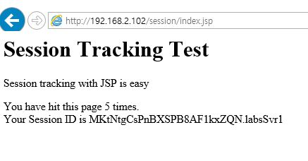
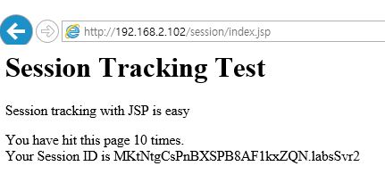
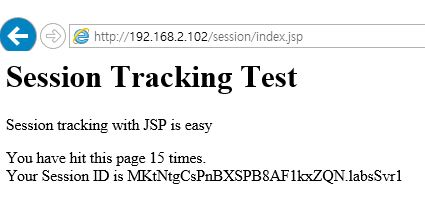

# Labs 11_01 
## 01 Clustering 구성
#### 1. NODE_NAME 설정 
Node별로 Name을 Unique하게 설정을 한다

env.sh 에 아래와 같이 추가
    
```
export NODE_NAME=$SERVER_NAME
.....
export JAVA_OPTS=" $JAVA_OPTS -Djboss.node.name=$NODE_NAME"
```
    
#### 2. Sticky session 설정
1) jvmRoute 또는 instance-id 설정
```
 jvmRoute=labsSvr1
```
  
2) useJK 설정
env.properties 에 UseJK 추가
```
UseJK=true
```
    
#### 3. JBOSS UDP cluster 설정 
1) env.sh 에 stack , multicast ip 설정
```
export MULTICAST_ADDR=230.1.0.1  
...
export JAVA_OPTS=" $JAVA_OPTS -Djboss.default.jgroups.stack=udp"
export JAVA_OPTS=" $JAVA_OPTS -Djboss.default.multicast.address=$MULTICAST_ADDR"
```
        
#### 4. Application web.xml 태그 추가 
web.xml 에 " distributable " 태그 추가
```
<?xml version="1.0" encoding="ISO-8859-1"?>
 
<web-app xmlns="http://java.sun.com/xml/ns/javaee"
          xmlns:xsi="http://www.w3.org/2001/XMLSchema-instance"
          xsi:schemaLocation="http://java.sun.com/xml/ns/javaee http://java.sun.com/xml/ns/javaee/web-app_2_5.xsd"
          version="2.5">
                  
          <display-name>simple test</display-name>
          <distributable/>  <-- 추가 
          ...
</web-app>
```
#### 5. Clustering 로그 확인 
server.log 에서 아래와 같이  정상적으로 클러스터링 된 로그를 확인

```
INFO  [org.jboss.as.clustering] (Incoming-1,shared=udp) JBAS010225: New cluster view for partition web (id: 1, delta: 1, merge: false) : [labsSvr1/web, labsSvr2/web]
INFO  [org.infinispan.remoting.transport.jgroups.JGroupsTransport] (Incoming-1,shared=udp) ISPN000094: Received new cluster view: [labsSvr1/web|1] [labsSvr1/web, labsSvr2/web]

```

## 02 Session Clusterint TEST  
#### 1) 서비스 확인 후 labsSvr1 shutdown 
http://localhost/session/index.jsp 접속 확인 



#### 2) labsSvr2 서버로 접속 하여 session 정상 확인 후 labsSvr1 start



#### 3) labsSvr1 정상 기동 완료 확인 후  labsSvr2 shutdown 

#### 4) labsSvr1 session 정상 확인 



