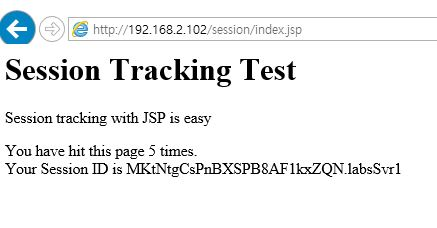
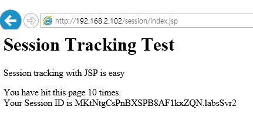
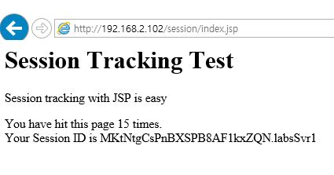

# Labs 11_02
## 02 TCP Clustering 구성
#### 1. NODE_NAME 설정 
Node별로 Name을 Unique하게 설정을 한다

env.sh 에 아래와 같이 추가
    
```
export NODE_NAME=$SERVER_NAME
.....
export JAVA_OPTS=" $JAVA_OPTS -Djboss.node.name=$NODE_NAME"
```
    
#### 2. Sticky session 설정
##### - env.properties 에 jvmRoute , UseJK 추가 

```
jvmRoute=labsSvr1
UseJK=true
```
    
#### 3. JBOSS TCP cluster 설정 
1) env.sh 에 stack protocol, unicast ip, unicast port 설정

```
# jgroups setting
export JAVA_OPTS=" $JAVA_OPTS -Djboss.default.jgroups.stack=tcp"
export JAVA_OPTS=" $JAVA_OPTS -Djgroups.tcpping.initial_hosts=192.168.0.56[7600],192.168.0.56[7700], "
```

2) standalone-ha.xml 에 추가 
```
<stack name="tcp">
    <transport type="TCP" socket-binding="jgroups-tcp"/>
    <protocol type="TCPPING" socket-binding="jgroups-mping">                 <!-- initial_hosts, port_range, timeout
        <property name="initial_hosts">                                           num_initial_members 추가 
            ${jgroups.tcpping.initial_hosts:localhost:7600,localhost:7600}        protocol type 은 TCPPING 확인 
        </property>
        <property name="port_range">
            0
        </property>
        <property name="timeout">
            3000
        </property>
        <property name="num_initial_members">
            3
        </property>
    </protocol>                                                                 -->
    <protocol type="MERGE2"/>
    <protocol type="FD_SOCK" socket-binding="jgroups-tcp-fd"/>
    <protocol type="FD"/>
    <protocol type="VERIFY_SUSPECT"/>
    <protocol type="pbcast.NAKACK"/>
    <protocol type="UNICAST2"/>
    <protocol type="pbcast.STABLE"/>
    <protocol type="pbcast.GMS"/>
    <protocol type="UFC"/>
    <protocol type="MFC"/>
    <protocol type="FRAG2"/>
    <protocol type="RSVP"/>
</stack>
```
        
#### 4. Application web.xml 태그 추가 
web.xml 에 " distributable " 태그 추가
```
<?xml version="1.0" encoding="ISO-8859-1"?>
 
<web-app xmlns="http://java.sun.com/xml/ns/javaee"
          xmlns:xsi="http://www.w3.org/2001/XMLSchema-instance"
          xsi:schemaLocation="http://java.sun.com/xml/ns/javaee http://java.sun.com/xml/ns/javaee/web-app_2_5.xsd"
          version="2.5">
                  
          <display-name>simple test</display-name>
          <distributable/>  <-- 추가 
          ...
</web-app>
```
#### 5. Clustering 로그 확인 
server.log 에서 아래와 같이  정상적으로 클러스터링 된 로그를 확인

```
INFO  [org.jboss.as.clustering] (Incoming-1,shared=udp) JBAS010225: New cluster view for partition web (id: 1, delta: 1, merge: false) : [labsSvr1/web, labsSvr2/web]
INFO  [org.infinispan.remoting.transport.jgroups.JGroupsTransport] (Incoming-1,shared=udp) ISPN000094: Received new cluster view: [labsSvr1/web|1] [labsSvr1/web, labsSvr2/web]

```

## 02 Session Clusterint TEST  
#### 1) 서비스 확인 후 labsSvr1 shutdown 
http://localhost/session/index.jsp 접속 확인 



#### 2) labsSvr1 서버 정지 확인 후 refresh 하여 서비스 확인 

session 이 끊기지 않고 labsSvr2로 접속 확인  



#### 3) labsSvr1 start 및 정상 기동 확인

labsSvr2 shutdown 

#### 4) refresh 하여 labsSvr1 session 정상 확인 


